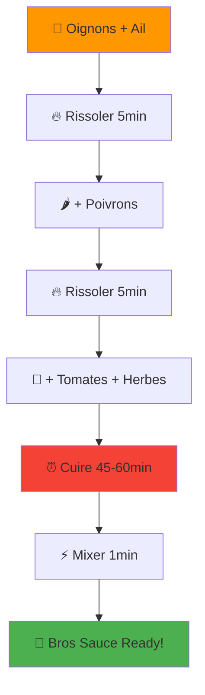
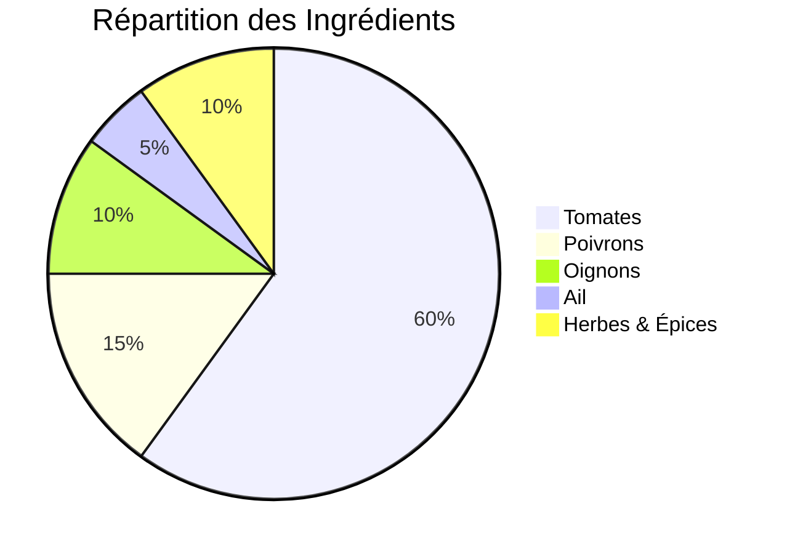
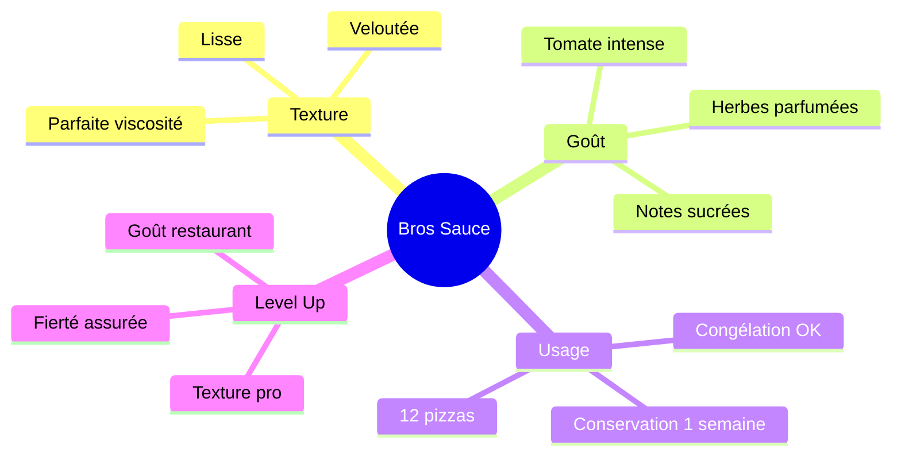
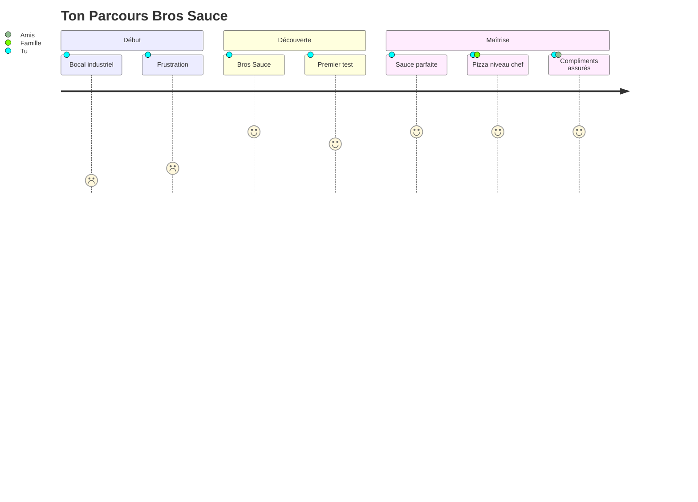

# 🍅 Bros Sauce Pizza - La Recette Ultime

> *La sauce tomate pizza maison la plus rapide, la plus clean, sans prise de tête, et 100% goût !*

## 🎯 Qu'est-ce que c'est ?

La **Bros Sauce** c'est THE recette de sauce tomate pour pizza qui va révolutionner tes soirées pizza maison ! Fini les bocaux industriels, place à une sauce fraîche, savoureuse et super facile à faire avec ton **Monsieur Cuisine**.

### ✨ Pourquoi Bros Sauce ?

- 🚀 **Ultra rapide** : Tout au robot, pas de prise de tête
- 🥕 **Sans épluchage** : On garde tout, même la peau des tomates
- 📦 **Gros batch** : 12 pizzas d'un coup (congélation friendly)
- 👨‍🍳 **Goût pro** : Texture et saveur de restaurant à la maison
- 💚 **Clean** : Que des vrais ingrédients, zéro additif

## 🎬 Le Process en un Coup d'Œil

## 🛒 Liste de Courses

### Légumes Frais

- **3 à 3,5 kg** de tomates mûres (tout type, bien rouges)
- **2 à 3** gros poivrons rouges
- **3** oignons 
- **4 à 6** gousses d'ail

### Condiments & Herbes
- **4-5 c. à soupe** d'huile d'olive
- **2-3 c. à soupe** d'origan séché
- **2-3 c. à soupe** de basilic (frais ou séché)
- **Sel & poivre** à volonté

### Options Bonus
- **1-2 c. à soupe** de vinaigre balsamique *(le petit plus qui change tout)*
- **1** carotte râpée *(pour adoucir)*
- **Pincée** de piment ou poivre de Cayenne *(pour les warriors)*

## ⚡ Timeline de Préparation

```mermaid
gantt
    title Planning Bros Sauce (1h15 total)
    dateFormat  HH:mm
    axisFormat %H:%M

    section Préparation
    Laver & découper légumes :prep, 00:00, 10m
    
    section Robot Cuisine
    Mixer oignons/ail :done, 00:10, 2m
    Rissoler base :done, 00:12, 5m
    Ajouter poivrons :done, 00:17, 7m
    Ajouter tomates & herbes :done, 00:24, 3m
    
    section Cuisson
    Cuisson principale :active, 00:27, 60m
    Mixer final :milestone, 01:27, 2m
    Réduction (si besoin) :01:29, 15m
```

## 🔥 Les Étapes Magiques

### Phase 1: Préparation (10 min)
Lave tes tomates, découpe-les en gros morceaux. **Pas besoin d'éplucher** ! C'est ça la magie Bros Sauce.

### Phase 2: Base Aromatique (7 min)
1. **Oignons + Ail** → Robot → Mix 10sec vitesse 6
2. **+ Huile d'olive** → Rissoler 5min/120°C/vitesse 1

### Phase 3: Construction (7 min)
1. **+ Poivrons** → Mix 10sec vitesse 5
2. **Rissoler** 5min/120°C/vitesse 1

### Phase 4: L'Assemblage Final (3 min)
Tomates + herbes + assaisonnements dans le robot. Panier cuisson posé sur le couvercle.

### Phase 5: La Transformation (1h)
**45-60min / 100°C / vitesse 2** - C'est là que la magie opère ! 🪄

### Phase 6: Finition (2 min)
**Mix 1min vitesse 10** progressivement. Attention à la vapeur ! 

## 📊 Résultats Attendus

## 🏆 Tips de Bros

### 🎯 Pour un Résultat Pro
- **Tomates bien mûres** = sauce plus sucrée naturellement
- **Panier cuisson** obligatoire pour éviter les projections
- **Patience pendant la cuisson** = concentration des saveurs

### 🚀 Variantes Bros
- **Version épicée** : Double dose de piment
- **Version gourmet** : + vinaigre balsamique vieilli
- **Version douce** : + carotte râpée

### 💾 Conservation
- **Frigo** : 1 semaine dans des bocaux stérilisés
- **Congélateur** : 6 mois en portions individuelles
- **Astuce** : Congèle en bacs à glaçons pour portions pizza

## 🎉 Mission Accomplie !

À partir de maintenant, tes pizzas maison vont faire pâlir de jalousie le pizzaïolo du coin ! 🍕

---

**Made with ❤️ by Bros AI** | *Pour des pizzas qui claquent depuis 2024*
